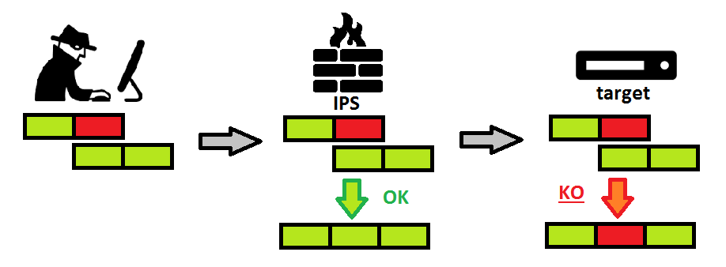

# Fugitive : IPS evasion tester

This tool tests "pure network" evasion techniques in order to check defense capabilities
to stop a **known attack against unconventionnal network transport protocols usages**.

## What is an IPS evasion

An evasion technique is a way of bypassing an IPS detection. This tool only deals with pure network evasions.

What we call "pure network evasions" here are evasion techniques only using **network protocol obfuscation**.
The actual payload is **known by the IDS/IPS**. The attack is stoped when no evasion is employed, and the
evasion **does not** change the application payload.
We are not speaking about malware obfuscation or encoding here, but really pure networking.

Basically, this tool will try to mess with som transport protocol header fields, to insert a difference between the
state of the IPS and the actual state of the target. The most basic example is overlaping IPv4 fragments :

```
Packet 1 : offset = 0   len = 16 : abcdefghijklmnop
Packet 2 : offset = 8   len = 18           **junk**qrstuvwxyz
```

Some IP stack might keep the first data arrived, leading to the defragmentation "abcdefghijklmnopqrstuvwxyz"
while some others will the the last data and defragmenting "abcdefgh\*\*junk\*\*qrstuvwxyz".

If the target uses the first convention, and the IPS the second, the alphabet signature of the IPS won't be matched,
while the target will defragment the alphabet.
This is a network evasion : the IPS has the correct signature, but the way data are transfered on the network prevents
the signature from matching.



As the convention used differs from an OS to an other, the tests will need the same server to run on different OS.

## Tests runned by this tool

* IPv4
    * Fragment identification : when are 2 fragments considered in the same packet ?
    * MF flag : what is the MF flag ? The last packet (in time) ? The last offset ?
    * Overlaping framgents : the most basic network evasion, see the explanation before.
    * Broadcast : the target receives a packet, same source, but not the same destination IP
    * Checksum : bad checksum injections
    * TTL (TODO)
    * IP len field (TODO)
* TCP
    * Inject data in every steps of the connection
    * FIN packet injections without ACK
    * Overlaping not yet acked fragments
    * FIN et RST outside the window
    * Checksum (TODO)
    * URG flag (TODO)
    * ...

**When it makes sense :**
* The test is also runned sending the packet in reverse order
* The test tries to bypass the IPS detection : the IPS does not defragment, but the target does
* The test tries to inject packet in the IPS : the IPS defragments (a TCP RST) but the target does not

## Quick start

A target server is installed, and returns "SUCCESS" when it receives the alphabet as url parameters.
The IPS is configured to block this "attack" : a signature is installed to match the alphabet.
This tool will try to fragment IP packets, mess with TCP flags, to still get a success answer,
from different servers running differents OS.

*Note : Fugitive can be configure to test with something else that the alphabet, see configuration below.*

### 1. Install dependencies

* python 2.7
* python-netifaces (tested with 0.10.4-0.1build2)
* python-scapy (tested with 2.2.0-1)

```
apt-get install python python-netifaces python-scapy
```

### 2. Configure the network


### 3. Configure the IDS/IPS

#### Inline mode

Any IPS can be used, but there is some limitation to take in consideration :
* The attacks using IP broadcast can only be tested against target on the same network.
Therefore, the IPS must be used in inline mode (totally transparent).
* The TTL attacks (not yet implemented) can only be used against a distant target : a router might be needed.

#### Defragmentation policy

Configure your IPS accordingly to your targets , regarding defragmentation policy, TTL, TCP, ...
You should configure it as you would in a production environment.

#### Add the payload signature

As stated before : pure network evasions here, we are giving a custom payload to the ips.
The signature can be found in ```server/abc.rules```, and should be compatible with most IPS.
```
drop http any any -> any any (msg:"alphabet detected"; content:"abcdefghijklmnopqrstuvwxyz"; nocase; classtype:policy-violation; sid:1; rev:1;)
```

If not, simply create a signature **DROPPING** any TCP packet containing the alphabet, in lowercase :
```abcdefghijklmnopqrstuvwxyz``` over any TCP connection.
No-one should ever be able to transmit the alphabet over TCP through the IPS.

#### GRO and LRO on virtual machines

Don't forget to disable GRO and LRO on your interfaces. This would mess with the IPS and checksum calculation.
```
sudo ethtool -K <interface> gro off lro off
```

### 4. Configuration of the target server

#### Target web server

The server to be attack in a simple web server returning "SUCCESS" when receiving an
URL parameter named "data" whose value is the alphabet in lowercase.
Check ```server/index.php```.

#### GRO and LRO on virtual machines

Again, you should disable it, to ensure correct checksum calculation.
```
sudo ethtool -K <interface> gro off lro off
```

### 5. Fugitive configuration

An example configuration file is available in ```sample.json```.
```
{
    "targets" : {
        "ubuntu": {
            "ipv4" : "192.168.189.202",
            "ipv4_broadcast" : "192.168.189.255",
            "ttl" : null,

            "http_port" : 80,
            "http_host" : "192.168.189.202"
        },
        "windows" : {
            "ipv4" : "192.168.189.1",
            "ipv4_broadcast" : "192.168.189.255",
            "ttl" : null,

            "http_port" : 80,
            "http_host" : "192.168.189.1"
        }
    },
    "tests" : {
        "http" : {
            "url" : "/index.php?data=abcdefghijklmnopqrstuvwxyz",
            "signature" : "abcdefghijklmnopqrstuvwxyz",
            "success" : "SUCCESS"
        }
    }
}
```
```targets``` is a dictionnary, associating a target friendly name to its location :
* ipv4 : IPv4 address
* ipv4_broadcast : IPV4 broadcast address reaching the host. Note that any router between fugitive
host and the target will stop the broadcast.
* ttl : null (not yet implemented)
* http_port : port used for the http test server
* http_host : virtual host to be used when reaching the http test server

```tests``` are the actual test method configuration.
We can here change the payload used by fugitive, for advanced usage.
* http : transmit a payload in an HTTP URL parameters
    * url : url to be accessed (with actual payload)
    * signature : the signature recognized by the IPS : fugitive will uses evasions in order to avoid
    matching this string. Not that this *must be a substring of url*
    * success : string to be searched in the server response to recognize a succeeded evasion.

If you are using the provided server page, you just have to configure the targets and their IPs accordingly
to your setup, in a ```config.json``` file.

### 6. scapy and iptables, as usual

As always when you're crafting packets, your own OS is your enemy : your own network
stack will reset the connection when the remote target will send you a packet. To avoid this, simply drop
the RST packets with your firewall :

```
iptables -A OUTPUT -p tcp --tcp-flags RST RST -o <output_interface> -j DROP
```

Replace \<output_interface\> with the interface name used to reach the targets (eth0, emc33, ...)

### 7. Check test environment

#### Check servers response to the payload

First, DISABLE the rules on your IPS, and start fugitive in check-only :
```
sudo ./fugitive -c config.json --check-only
```

What we expect here :
* all targets should be reached
* payload must be failed to be matched (IPS disabled)
* the server should respond a success (it received the payload properly)

```
## Testing ubuntu ##

[?] Check connection
Output interface for 192.168.189.202 is eth2
CONNECTION OK
[?] Check detection
Test succeed : DETECTION FAILED
```
As we see here : without evasion, we get a SUCCESS response, meaning the detection failed.
We can now be certain that our server works properly : if it receives the payload, we will get a SUCCESS.

#### Check the IPS detection

So server is ok, let's  check the IPS :
Activate your detection rules (especially the alphabet one), and test again :
```
sudo ./fugitive -c config.json --check-only
```

This time, you should get all green lights :
```
## Testing ubuntu ##

[?] Check connection
Output interface for 192.168.189.202 is eth2
CONNECTION OK
[?] Check detection
DETECTION OK : Disconnected : No correct ACK from remote host
```

The IPS detected the attack, and dropped the packet. From the fugitive point of view, it sent a PUSH-ACK packet with the payload,
and never got a response ACK (because the target never actually received the PUSH-ACK packet)

### 8. Start testing

To run all the tests, and store the results in a folder named "output" :
```
sudo ./fugitive -c config.json -o output
```

## Usage

### Command line arguments


```
sudo ./fugitive -h
```

```
-e NAME : only starts evasion whose path contains NAME
--list : list the evasion select
-t TARGET : only test one target
--check-only / --no-check : only run the checks / don't run them
```

### Example

```
sudo ./fugitive -e IPv4/Fragmentation/Identifier --list

[+] IPv4
    [+] Fragmentation
        [+] Identifier
            [FragDest.bypass] Fragment Destination bypass
            [FragDest.inject] Fragment Destination inject
            [FragDestBroadcast.bypass] Fragment Broadcast Destination bypass
            [FragDestBroadcast.inject] Fragment Broadcast Destination inject
            [FragProt.bypass] Fragment Protocol bypass
            [FragProt.inject] Fragment Protocol inject
            [SameId.bypass] Same Frag ID bypass
            [SameId.inject] Same Frag ID inject
```

## Contact

If you have any qestions / ideas concerning this tool, please feel free to contact me :
```
jeremy [dot] beaume (a) protonmail {dot} com
```
